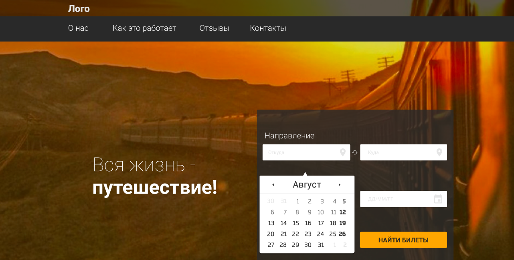

# TrainBooking
Дипломная работа к профессии frontend-разработчик (Система бронирования ЖД билетов)

## Описание

Данное React-приложение является демо-версией системы поиска и бронирования ЖД билетов. 

### Поиск направлений
 
На данный момент приложение позволяет найти билеты только по следующим направлениям:
* Москва
* Санкт-Петербург
* Все города, начинающиеся на букву А

### Возможности приложения

Приложение позволяет:
* просмотреть все возможные поезда по заданным направлениям
* выбрать дату путешествия
* отсортировать найденные поезда по длительности путешествия
* отфильтровать найденные поезда по различным параметрам, например, по типу вагона, по цене билета, а также по времени прибытия и отправления (**В связи с техническими неполадками на сервере фильтрация по прибытию и отправлению временно не работает**)
* выбрав подходящий поезд, указать количество пассажиров и выбрать места на схеме вагона
* указать данные всех пассажиров и перейти к оплате билетов

### Используемые технологии

Данное приложение написано на React без использования Redux. Компоненты и логика их работы описаны преимущественно в функциональном стиле с применением React Hooks. В проекте также использованы внешние библиотеки, такие как material-ui, Momentum.js, jQuery. В качестве сборщика использовался менеджер пакетов npm, основа приложения -  create-react-app. 

Приложение является дипломным проектом курса frontend-разработчик от Нетологии, поэтому серверная сторона проекта была предоставлена в качестве исходного материала, все остальное, включая верстку, было выполнено мной.

## Этапы разработки

Разработку SPA (Single Page Application) рекомендуется
разделить на следующие этапы:

1. [Установка и настройка проекта](./reference/step-1.md)
2. [Вёрстка проекта](./reference/step-2.md)
3. [Базовое внедрение React](./reference/step-3.md)
4. [Полностью готовый frontend](./reference/step-4.md)

